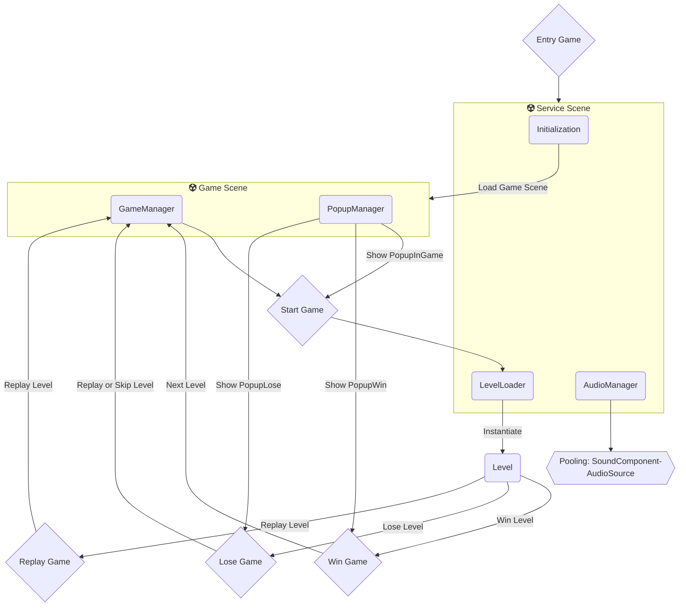

# Base Game Unity (Andorid & iOS), Use Scriptable Architecture
- Unity 6 (LTS)
  
Description: Gamebase for mobile hyper casual, casual game 

- Use [sunflower](https://github.com/VirtueSky/sunflower) package

- GameFlow

## Note
### GameConfig Window
- Shortcut (`Ctrl + ~` or `Command + ~`) to open GameConfig Window

- Open the `GameConfig` script to add or edit configs,

### DebugView

- Enable Debug View `true` in GameConfig window
- Swipe up on the edge (left or right) of the screen to open (shortcut in editor (`Alt+D` or `Option+D`))

- Note: Version don't use addressable [here](https://github.com/VirtueSky/TheBeginning/tree/dont_use_addressable)

